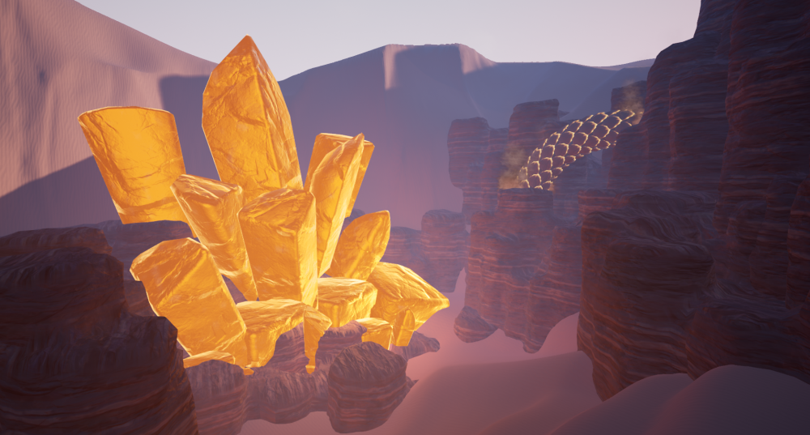

# Amber: *Short walking simulator* - **Unreal Engine 4/C++**

### ISART DIGITAL : School Project
- MGA1 - William LAHEMAR-BOISSEAU - Lily ROZIER-CASSIMI - Élise MONCOURIER
- GP3 - Manon MÉHALIN - Rémi GINER

 

<!-- ABOUT THE PROJECT -->
# About The Project

The goal of the project was to showcase technical features using Unreal Engine materials, Niagara system and housemade rendering tools.

# Table of contents
1. [Features & usage](#features--usage)
    - [Features](#features)
    - [Controls](#controls)
3. [How to launch](#how-to-launch)
5. [References](#references)
6. [Versionning](#versionning)
6. [Autors](#authors)

# Features & usage

## Features
- Sandstorm (with fog)
- Quicksands
- Animal life (giant worms, geckos)
- Footprints
- Other effects (sand decals, sand trails...)

## Controls
The controls are made for keyboard only:
- WASD - Move the player
- Mouse movements - Rotate the player

## References:
- https://tandreades.com/projects/KrgYdR 
- https://www.youtube.com/watch?v=o-MXAmfCY5U
- https://www.youtube.com/watch?v=GhtZK8J2LcM
- https://www.youtube.com/watch?v=uHDMj0-i8BY
- https://www.youtube.com/watch?v=7nNxkKA5g5A
- https://www.youtube.com/watch?v=HoeTIUf8Qs8&ab_channel=CodeLikeMe

## Versionning
Perforce (P4V) was used for the versioning during the development of the project.

## Authors
- **William LAHEMAR-BOISSEAU** 
- **Lily ROZIER-CASSIMI** 
- **Élise MONCOURIER** 
- **Manon MÉHALIN** 
- **Rémi GINER**  
